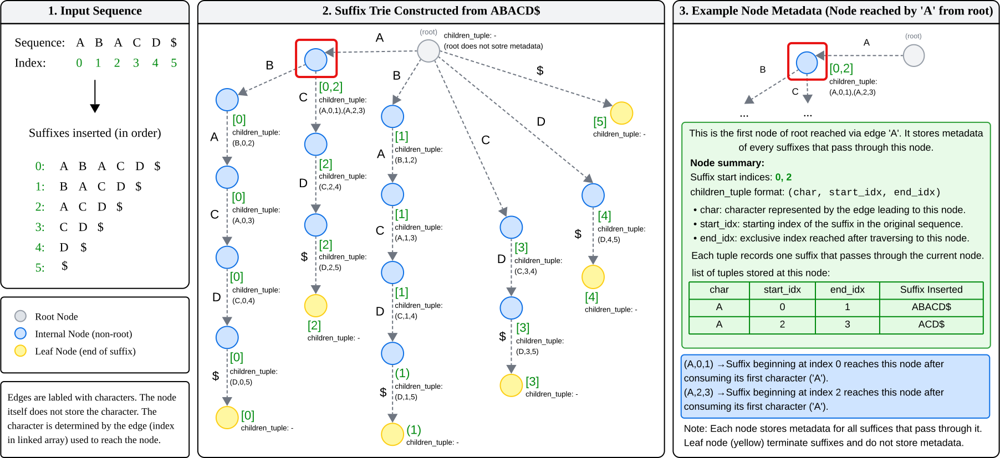
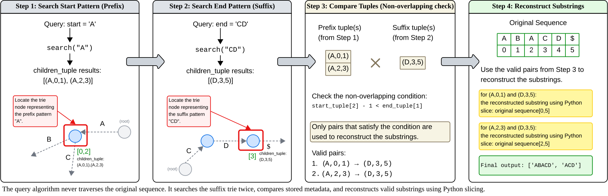

# Suffix Trie Pattern Finder

# Suffix Trie Pattern Finder


A Python implementation of a suffix trie...

A Python implementation of a suffix trie for efficient substring pattern matching. The project preprocesses an input sequence into a suffix trie and supports repeated queries to find all substrings that begin with a specified prefix and end with a specified suffix while enforcing a non-overlapping constraint.

---

## Overview

This project models a string indexing problem using a suffix trie. During preprocessing, every suffix of the input sequence is inserted into the trie, allowing substring occurrences to be located efficiently through trie traversal.

Unlike a standard substring search problem, a valid query must satisfy three conditions:

- the substring begins with a specified prefix,
- the substring ends with a specified suffix,
- the prefix and suffix do not overlap.

To support efficient repeated queries, each non-root trie node stores metadata describing every suffix passing through that node. This allows all occurrences of a searched prefix or suffix to be retrieved without traversing the original sequence.

The primary challenge of this project lies in designing the trie representation and metadata storage rather than the search itself. By preprocessing the sequence once, multiple pattern queries can be answered efficiently using trie traversal and metadata comparisons.

---

## Suffix Trie Construction

The figure below illustrates how the suffix trie is constructed from an input sequence and how metadata (`children_tuple`) is stored at each non-root node during suffix insertion. The highlighted node demonstrates how each tuple records the suffixes passing through that node, enabling efficient pattern matching during later queries.



**Figure 1.** Construction of the suffix trie from the input sequence `ABACD$`. Each non-root node stores metadata describing every suffix that passes through it, allowing later queries to efficiently reconstruct valid prefix–suffix matches without traversing the original sequence.

---

## Query Processing

After the suffix trie has been constructed, each query is processed by searching the trie twice and comparing the stored metadata rather than traversing the original sequence.

The algorithm performs the following steps:

1. Search the trie using the **start** pattern.
2. Search the trie using the **end** pattern.
3. Compare the returned metadata to identify valid non-overlapping tuple pairs.
4. Reconstruct the corresponding substrings using Python slicing.

The overlap constraint is enforced using:

```python
if start_tuple[2] - 1 < end_tuple[1]:
```

where:

- `start_tuple[2]` is the exclusive index reached after matching the start pattern.
- `end_tuple[1]` is the starting index of the matched end pattern.

Each valid tuple pair reconstructs a substring using:

```python
genome[start_tuple[1] : end_tuple[2]]
```

which naturally follows Python's end-exclusive slicing semantics.

The example below demonstrates the complete query workflow.



**Figure 2.** Example query execution using the stored metadata. The algorithm searches the suffix trie twice, compares metadata associated with the matched prefix and suffix, validates the non-overlapping constraint, and reconstructs the resulting substrings using Python slicing.

---

## Features

- Suffix trie construction from an input sequence
- Efficient repeated substring pattern queries
- Custom `Node`, `SuffixTrie`, and `PatternFinder` implementations
- Metadata indexing for substring occurrence retrieval
- Prefix–suffix matching with non-overlapping validation
- Modular object-oriented architecture

---

## Technologies

- Python
- String Algorithms
- Suffix Trie
- Trie Traversal
- Object-Oriented Programming (OOP)

---

## Time Complexity

Let **N** denote the length of the input sequence.

| Operation | Complexity |
| :--- | :---: |
| Build Suffix Trie | **O(N²)** |
| Search Prefix | **O(P)** |
| Search Suffix | **O(S)** |
| Pattern Matching | **O(P + S + N³)** |
| Space Complexity | **O(N²)** |

where:

- **P** = length of the prefix
- **S** = length of the suffix

---

## Project Structure

```text
suffix-trie-pattern-finder/
│
├── archive/
│   └── full_code_archive.py
│
├── examples/
│   └── example_usage.py
│
├── images/
│   ├── suffix_trie_construction.svg
│   └── pattern_finder_query.svg
│
├── src/
│   ├── __init__.py
│   ├── node.py
│   ├── suffix_trie.py
│   └── pattern_finder.py
│
├── tests/
│   └── test_pattern_finder.py
│
├── LICENSE
├── README.md
└── .gitignore
```

---

## Assumptions

The implementation assumes the following conditions hold:

- The input sequence consists only of the supported alphabet (`A`, `B`, `C`, `D`).
- Query strings use the same alphabet.
- The input sequence is static after construction.
- The terminal symbol `$` is reserved internally and should not appear in user input.
- Prefix and suffix matches are considered valid only when they do not overlap.

---

## Example Usage

```python
from src import PatternFinder

finder = PatternFinder("AAABBBCCC")

matches = finder.find("AAA", "BB")

print(matches)
```

**Output**

```text
['AAABB', 'AAABBB']
```

---

## Testing

The project includes unit tests covering representative pattern-matching scenarios, including:

- Standard prefix–suffix matching
- Multiple valid substring matches
- Enforcement of the non-overlapping constraint
- Missing prefix
- Missing suffix
- Repeated-character worst-case input
- Multiple queries using the same `PatternFinder` instance

Run the test suite with:

```bash
python -m pytest -v
```

---

## Skills Demonstrated

- Suffix trie construction
- Trie traversal
- String indexing
- Pattern matching algorithms
- Complexity analysis
- Object-oriented software engineering

---

## Future Improvements

Potential extensions to this project include:

- Support arbitrary alphabets instead of `{A, B, C, D}`
- Compress the trie into a suffix tree to reduce memory usage
- Support wildcard pattern matching
- Visualize dynamic trie construction and query execution interactively.
- Benchmark against established string-search algorithms and libraries.

---

## License

This project is licensed under the MIT License. See the [LICENSE](LICENSE) file for details.